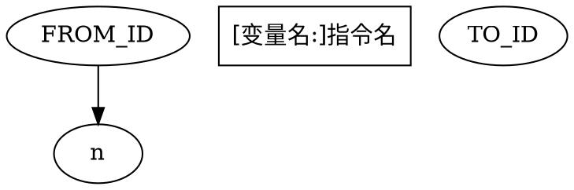
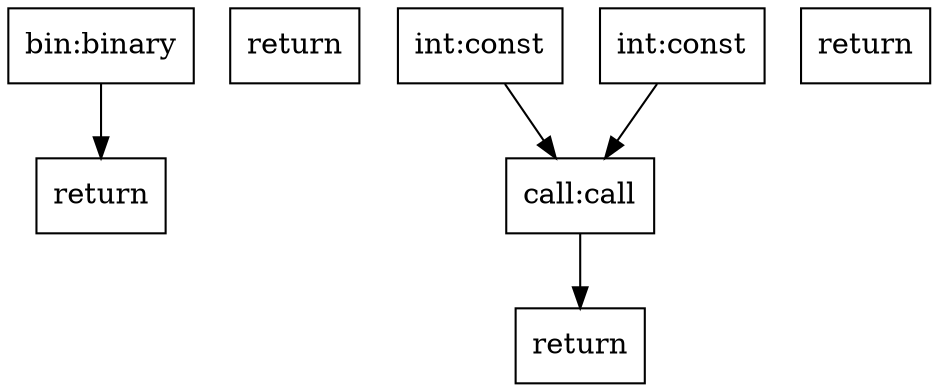

# Core IR Schema — 实现层 IR (.ccr) 与数据流图 (.cir)

## 概述

Core 编译器使用两层中间表示：

| 格式 | 全称 | 用途 | 生产者 | 消费者 |
|------|------|------|--------|--------|
| `.ccr` | Core Control-flow Representation | 线性 CFG IR，前后端接口 | `corec`（前端） | `corearch`（后端） |
| `.cir` | Core IR Graphviz | 数据流图 DOT 格式（可视化调试） | `corec ir` / `cmd_ir` | Graphviz 渲染 |

自托管编译器在 IR 生成期间**同时**构建数据流图（`.cir`）和线性 IR（`.ccr`），然后 `lower_to_ccr()` 将图节点拷贝为线性指令数组供 x86-64 后端消费。

---

## 一、二进制 `.ccr` 格式（v3）

### 格式演进

| 版本 | 新增内容 | 说明 |
|------|----------|------|
| v1 | 基础格式 | 头 + 字符串 + 函数元信息 + 指令 + 变量 + 字符串常量 + 结构体 + 枚举 |
| v2 | 全局变量段 | `globals` 段：全局变量名→变量索引映射 |
| v3 | 优化元数据段 | `opt_meta` 段：key-value 元数据，供寄存器分配/CSE 等优化传递信息 |

加载器兼容：`load_ccr()` 接受 version 1/2/3，按版本条件读取对应段。

### 整体布局

```
[文件头：36 字节]
[字符串表：变长]
[函数元信息数组：func_count × 28 字节]
[IR 指令数组：instr_count × 24 字节]
[IR 变量数组：var_count × 12 字节]
[字符串常量索引数组：str_const_count × 4 字节]
[结构体定义数组：变长]
[枚举定义数组：变长]
[全局变量段 (v2+)：4 + global_count × 8 字节]
[优化元数据段 (v3+)：4 + 变长]
```

所有整数采用小端序（little-endian）。

### 文件头（36 字节）

| 偏移 | 大小 | 字段 | 说明 |
|------|------|------|------|
| 0 | 4 | magic | `0x31524343`（ASCII `CCR1`） |
| 4 | 4 | version | 版本号，当前为 3 |
| 8 | 4 | func_count | 函数数量 |
| 12 | 4 | instr_count | IR 指令数量 |
| 16 | 4 | var_count | IR 变量数量 |
| 20 | 4 | str_count | 字符串表条目数 |
| 24 | 4 | str_const_count | 字符串常量索引数 |
| 28 | 4 | struct_count | 结构体定义数 |
| 32 | 4 | enum_count | 枚举定义数 |

### 字符串表

`str_count` 个条目，每个条目：

| 偏移 | 大小 | 字段 | 说明 |
|------|------|------|------|
| 0 | 4 | len | 字符串字节长度（不含 null 终止） |
| 4 | len | data | UTF-8 字符串内容 |

### 函数元信息

`func_count` 个条目，每个条目 28 字节：

| 偏移 | 大小 | 字段 | 说明 |
|------|------|------|------|
| 0 | 4 | name_idx | 函数名在字符串表中的索引 |
| 4 | 4 | param_count | 参数数量 |
| 8 | 4 | ret_type | 返回类型（TI_* 值） |
| 12 | 4 | instr_start | 指令数组中的起始位置（含标签/控制流指令） |
| 16 | 4 | instr_count | 指令数量 |
| 20 | 4 | var_start | 变量数组中的起始位置 |
| 24 | 4 | var_count | 变量数量 |

**注意**：函数的指令和变量在全局数组中连续排列，`instr_start..instr_start+instr_count` 范围内的指令属于该函数。函数边界内的指令包含 `IR_LABEL`、`IR_BRANCH`、`IR_JUMP` 等控制流指令。

### IR 指令数组

`instr_count` 个条目，每个条目 24 字节：

| 偏移 | 大小 | 字段 | 说明 |
|------|------|------|------|
| 0 | 4 | opcode | IR 操作码（u32） |
| 4 | 4 | dest | 目标变量索引（-1 = 无结果，i32） |
| 8 | 4 | src1 | 操作数 1（i32，语义见操作码表） |
| 12 | 4 | src2 | 操作数 2（i32） |
| 16 | 4 | src3 | 额外数据（标签、字段索引、函数名索引等；i32） |
| 20 | 4 | type_kind | 类型信息（TI_* 值，u32） |

**编码说明**：
- `dest`、`src1`、`src2`、`src3` 为有符号 i32（`buf_write_i32` 使用补码）；`opcode`、`type_kind` 为无符号 u32
- 部分指令将 src 字段用作标量值（如 `IR_CONST` 的 src1=整数值）而非变量索引
- `IR_CALL`/`IR_SPAWN`：src1=首个参数变量索引，src2=参数个数，src3=函数名字符串索引

### IR 变量数组

`var_count` 个条目，每个条目 **12 字节**（二进制格式）：

| 偏移 | 大小 | 字段 | 说明 |
|------|------|------|------|
| 0 | 4 | name_idx | 变量名在字符串表中的索引（u32） |
| 4 | 4 | id | 变量 ID（通常等于数组索引，u32） |
| 8 | 4 | type_kind | 变量类型（TI_* 值，u32） |

**注意**：内存中每个变量占 24 字节（3 × u64，见 `ESZ_IRVAR = 24`），但二进制序列化使用更紧凑的 12 字节（3 × u32）。`calc_ccr_size()` 当前使用 `g_ir_var_count * 16` 计算大小，与实际的 12 字节/条目存在 4 字节偏差，但缓冲区的多余空间不会影响正确性。

### 字符串常量索引数组

`str_const_count` 个条目，每个条目 4 字节：字符串表索引（u32）。用于运行时字符串字面量的索引。

### 结构体定义数组

`struct_count` 个条目：

| 偏移 | 大小 | 字段 | 说明 |
|------|------|------|------|
| 0 | 4 | name_idx | 结构体名在字符串表中的索引 |
| 4 | 4 | field_count | 字段数量 |
| 8 | field_count×8 | fields | 每个字段 `[name_idx(4), type(4)]` |

### 枚举定义数组

`enum_count` 个条目：

| 偏移 | 大小 | 字段 | 说明 |
|------|------|------|------|
| 0 | 4 | name_idx | 枚举名在字符串表中的索引 |
| 4 | 4 | variant_count | 变体数量 |
| 8 | — | variants | 见下方 |

每个变体：

| 偏移 | 大小 | 字段 | 说明 |
|------|------|------|------|
| 0 | 4 | name_idx | 变体名在字符串表中的索引 |
| 4 | 4 | type_count | 变体包含的字段类型数量 |
| 8 | type_count×4 | types | 字段类型（TI_* 值） |

### 全局变量段（v2+）

| 偏移 | 大小 | 字段 | 说明 |
|------|------|------|------|
| 0 | 4 | global_count | 全局变量数量（u32） |
| 4 | global_count×8 | globals | 每个条目 `[name_idx(4), var_idx(4)]` |

每个全局变量条目记录其名称索引和对应的 IR 变量索引。加载器按版本检查：`if ver >= 2` 时读取此段。

### 优化元数据段（v3+）

| 偏移 | 大小 | 字段 | 说明 |
|------|------|------|------|
| 0 | 4 | meta_count | 元数据条目数（u32） |
| 4 | — | entries | 见下方 |

每个元数据条目：

| 偏移 | 大小 | 字段 | 说明 |
|------|------|------|------|
| 0 | 4 | key | 元数据键（u8 填充到 u32 宽度） |
| 4 | 4 | data_len | 数据字节长度（u32） |
| 8 | data_len | data | 原始字节数据 |

当前定义的元数据 key：

| key 值 | 名称 | 数据格式 | 用途 |
|--------|------|----------|------|
| 1 | register_assignment | 每个 u32 为变量 i 分配的寄存器号（0-13，255=栈） | 线性扫描寄存器分配结果 |
| 2 | opt_level | u32 | 优化级别（0/1/2） |

加载器按版本检查：`if ver >= 3` 时读取此段。

---

## 二、IR 操作码

| 编号 | 名称 | 语义 | dest | src1 | src2 | src3 |
|------|------|------|------|------|------|------|
| 0 | NOP | 空操作 | — | — | — | — |
| 1 | CONST | 加载常量 | 变量索引 | 整数值 | — | — |
| 2 | BINARY | 二元运算 | 结果变量 | 左操作数变量 | 右操作数变量 | 操作码（见下方） |
| 3 | UNARY | 一元运算 | 结果变量 | 操作数变量 | — | — |
| 4 | CALL | 函数调用 | 结果变量（可选） | 首个参数变量索引 | 参数个数 | 函数名字符串索引 |
| 5 | RETURN | 函数返回 | — | 返回值变量（-1=void） | — | — |
| 6 | ALLOC | 分配栈空间（类型化） | 目标变量 | — | — | — |
| 7 | ALLOC_STRUCT | 分配结构体 | 目标变量 | — | — | 结构体名索引 |
| 8 | ALLOC_ARRAY | 分配数组 | 目标变量 | 元素数量 | — | — |
| 9 | STORE | 变量赋值 | — | 目标变量 | 值变量 | — |
| 10 | LOAD | 变量读取 | 结果变量 | 源变量 | — | — |
| 11 | LOAD_FIELD | 读取结构体字段 | 结果变量 | 结构体变量 | — | 字段索引 |
| 12 | STORE_FIELD | 写入结构体字段 | — | 结构体变量 | 值变量 | 字段索引 |
| 13 | LOAD_INDEX | 数组常量索引读取 | 结果变量 | 数组变量 | — | 常量索引 |
| 14 | STORE_INDEX | 数组常量索引写入 | — | 数组变量 | 值变量 | 常量索引 |
| 15 | LOAD_INDEX_VAR | 数组变量索引读取 | 结果变量 | 数组变量 | 索引变量 | — |
| 16 | STORE_INDEX_VAR | 数组变量索引写入 | 值变量 | 数组变量 | 索引变量 | 第三个操作数（见注意） |
| 17 | MAKE_ENUM | 创建枚举实例 | 目标变量 | 变体名索引 | — | — |
| 18 | REF | 取引用 | 结果变量 | 源变量 | — | — |
| 19 | BRANCH | 条件分支 | — | 条件变量 | true 标签编号 | false 标签编号 |
| 20 | JUMP | 无条件跳转 | — | 目标标签编号 | — | — |
| 21 | LABEL | 标签定义 | — | 标签编号 | — | — |
| 22 | PHI | φ 节点 | 结果变量 | 首个源变量 | 源数量 | 第二个源变量 |
| 23 | LOAD_ENUM_TAG | 读取枚举标签 | 结果变量 | 枚举变量 | — | — |
| 24 | SLICE | 创建切片 | 目标变量 | 数组变量 | 起始索引变量 | 结束索引变量 |
| 25 | DEREF | 解引用 | 结果变量 | 引用变量 | — | — |
| 26 | STORE_PTR | 通过指针写入 | 值变量 | 指针变量 | 值变量 | — |
| 27 | SPAWN | 并发启动（go） | 结果变量（future） | 函数名索引 | 首个参数 | 参数个数 |
| 28 | YIELD | 生产者产出值 | — | 值变量 | — | — |
| 29 | AWAIT | 等待 future | 结果变量 | future 变量 | — | — |

### 操作码编号（代码中常量定义）

源代码：`src/compiler/ast.cr` 第 507-536 行

```
IR_NOP:0, IR_CONST:1, IR_BINARY:2, IR_UNARY:3, IR_CALL:4, IR_RETURN:5,
IR_ALLOC:6, IR_ALLOC_STRUCT:7, IR_ALLOC_ARRAY:8,
IR_STORE:9, IR_LOAD:10, IR_LOAD_FIELD:11, IR_STORE_FIELD:12,
IR_LOAD_INDEX:13, IR_STORE_INDEX:14, IR_LOAD_INDEX_VAR:15, IR_STORE_INDEX_VAR:16,
IR_MAKE_ENUM:17, IR_REF:18,
IR_BRANCH:19, IR_JUMP:20, IR_LABEL:21, IR_PHI:22, IR_LOAD_ENUM_TAG:23,
IR_SLICE:24, IR_DEREF:25, IR_STORE_PTR:26,
IR_SPAWN:27, IR_YIELD:28, IR_AWAIT:29
```

### 二元运算操作码（src3 字段）

| 值 | 名称 | C 符号 |
|----|------|--------|
| 1 | ADD | `+` |
| 2 | SUB | `-` |
| 3 | MUL | `*` |
| 4 | DIV | `/` |
| 5 | MOD | `%` |
| 6 | EQ | `==` |
| 7 | NE | `!=` |
| 8 | LT | `<` |
| 9 | GT | `>` |
| 10 | LE | `<=` |
| 11 | GE | `>=` |
| 12 | AND | `&&` |
| 13 | OR | `\|\|` |

---

## 三、类型常量（TI_*）

| 值 | 名称 | 说明 |
|----|------|------|
| 0 | TI_INT | 整数（有符号 64 位） |
| 1 | TI_FLOAT | 浮点数（当前为占位） |
| 2 | TI_BOOL | 布尔值 |
| 3 | TI_STR | 字符串（字节数组指针 + 长度 header） |
| 4 | TI_UNIT | 空类型（即 void） |
| 5 | TI_NEVER | 发散类型 |
| 6 | TI_CHAR | 字符（当前为占位） |

**注意**：TI_NEVER 在 `.ccr` 格式中保留但当前未实际使用。更多类型（如指针区分、泛型具现化类型）在 `src/compiler/checker.cr` 的类型编码系统（`type_enc`，编码为整数）中表达，不在 `.ccr` 头的 TI_* 枚举中。

---

## 四、数据流图 `.cir` 格式

`.cir` 是数据流图的 DOT 格式输出，用于可视化调试和未来的数据流解释器。

### 文本格式（DOT）



- **节点 ID**：整数索引（从 0 开始，按 AST 遍历创建顺序连续分配）
- **标签格式**：`[变量名:]指令名`，变量名为目标 IR 变量的名称（如有）
- **边**：定义-使用链 —— 生产者节点指向消费者节点

### 示例

来自 `examples/add/main.cir`：


### 自托管编译器 `.cir` 生成

由 `src/compiler/dump.cr` 的 `cmd_ir()` 调用 `df_graph_to_dot()`（`dataflow.cr` 第 246-279 行）生成。

- 所有函数输出到同一个 DOT 图中（无子图分隔）
- 节点标签仅包含指令名和可选的 dest 变量名
- 边从 `g_df_edges[]` 中遍历

生成的 `.cir` 文件示例输出：
```
 -> program.cir (42 nodes, 58 edges)
```

### Python 引导编译器 `.cir` 生成

由 `tools/corec ir` 子命令调用 `extract_all()`（`cir.py` 第 308-310 行）生成。

- 每个函数独立输出一个 `digraph { func_name }` DOT 子图
- 节点标签包含**语义分类信息**（算术/比较/逻辑等类别）
- 边通过变量 ID 的定义-使用链追踪

Python 版本的语义信息更丰富（见 `_instr_kind_and_sem()` 函数），但自托管版本是实际生产路径。

### 操作码助记符

自托管编译器中的 `df_opcode_name()`（`dataflow.cr` 第 281-311 行）：

```
const, binary, unary, call, return,
alloc, alloc_struct, alloc_array,
store, load, load_field, store_field,
load_index, store_index, load_index_var, store_index_var,
make_enum, ref,
branch, jump, label, phi,
load_enum_tag, slice, deref, store_ptr,
spawn, yield
```

---

## 五、数据流图内部结构（内存表示）

自托管编译器在 `src/compiler/ast.cr` 中定义 DFNode 和 DFEdge 结构体：

### DFNode（64 字节/条目）

| 偏移 | 大小 | 字段 | 说明 |
|------|------|------|------|
| 0 | 8 | opcode | IR 操作码 |
| 8 | 8 | dest_var | 此节点定义的目标变量索引（无结果则为 -1） |
| 16 | 8 | src1 | 操作数 1 |
| 24 | 8 | src2 | 操作数 2 |
| 32 | 8 | src3 | 额外数据 |
| 40 | 8 | type_kind | 类型（TI_* 值） |
| 48 | 8 | first_edge | 首条出边在 `g_df_edges[]` 中的索引（-1 = 无） |
| 56 | 8 | edge_count | 出边数量 |

### DFEdge（24 字节/条目）

| 偏移 | 大小 | 字段 | 说明 |
|------|------|------|------|
| 0 | 8 | from_node | 源节点 ID |
| 8 | 8 | to_node | 目标节点 ID |
| 16 | 8 | next_out | 同一源节点的下一条出边索引（-1 = 结尾） |

边使用邻接列表结构：每个节点通过 `first_edge` → `next_out` 链表遍历其出边。

### 辅助数组

| 数组 | 元素大小 | 用途 |
|------|----------|------|
| `g_df_var_producer[]` | 8 字节/条目 | 对于每个 IR 变量，记录产生该变量的节点 ID |
| `g_df_func_node_start[]` | 8 字节/条目 | 每个函数在 `g_df_nodes[]` 中的起始索引 |
| `g_df_func_node_count[]` | 8 字节/条目 | 每个函数中的节点数 |

### 边构建规则

边由 `df_connect_srcs()`（`dataflow.cr` 第 91-189 行）根据操作码类型自动构建。核心规则：

- `IR_CONST`：所有 src 为标量值，不产生边
- `IR_BINARY`：src1 和 src2 均为变量 → 两条边
- `IR_CALL`/`IR_SPAWN`：src1 到 src1+src2-1 为连续参数变量 → 多条边
- `IR_RETURN`：src1 >= 0 时为返回值变量 → 一条边
- `IR_BRANCH`：src1 为条件变量 → 一条边（标签在 src2/src3，非变量）
- `IR_STORE`/`IR_STORE_FIELD`/`IR_STORE_INDEX`：目标 + 值 → 两条边
- `IR_LABEL`/`IR_JUMP`/`IR_PHI`/`IR_ALLOC` 等：无变量输入 → 无边

---

## 六、线性化过程（数据流图 → 线性 CFG）

`lower_to_ccr()`（`dataflow.cr` 第 193-226 行）将数据流图线性化为线性 IR 指令数组。

**关键设计**：数据流图与线性 IR 在 `emit()` 调用期间**并行**构建，而非从图单独降级。每个 `emit()` 调用同时：
1. 填充 `g_ir_instrs[]`（线性 IR 数组）
2. 调用 `df_create_node()`（在 `g_df_nodes[]` 中创建对应节点并构建边）

线性化的过程实际上是**重建** `g_ir_instrs[]` — 从 `g_df_nodes[]` 拷贝字段：

```
g_ir_instrs[i].opcode   = g_df_nodes[i].opcode
g_ir_instrs[i].dest     = g_df_nodes[i].dest_var
g_ir_instrs[i].src1..3  = g_df_nodes[i].src1..3
g_ir_instrs[i].type_kind = g_df_nodes[i].type_kind
```

由于节点按创建顺序（AST 遍历顺序）排列，自然满足拓扑顺序，无需额外排序。线性化后重新计算各函数的指令边界。

---

## 七、文本 `.ccr` 转储格式

自托管编译器的 `cmd_cir()`（`dump.cr` 第 222-287 行）生成人类可读的 `.ccr` 文本转储，格式如下：

```
Function: 函数名
  Block: label标签编号:
    指令文本

Function: add
  Block: label0:
    const: dest = 42
  Block: label1:
    binary: dest = a + b
    return: dest
```

指令文本格式由 `ir_instr_str()`（`dump.cr` 第 39-178 行）生成，不同指令有不同格式：

| 指令 | 文本格式 |
|------|----------|
| CONST | `d = 值` |
| BINARY | `d = s1 OP s2` |
| CALL | `d = call func(args...)` |
| RETURN | `value` 或 `void` |
| ALLOC | `d : int` |
| ALLOC_STRUCT | `d : struct name` |
| LOAD_FIELD | `d = s1.字段索引` |
| BRANCH | `if s1 goto labelN else labelM` |
| JUMP | `goto labelN` |
| LABEL | `labelN:` |
| PHI | `d = phi(s1, s2, ...)` |

---

## 八、代码文件索引

| 文件 | 角色 |
|------|------|
| `src/compiler/ast.cr` | DFNode/DFEdge 结构体、IR 操作码常量、TI_* 类型常量 |
| `src/compiler/dataflow.cr` | 图构建（`df_create_node()`）、边连接（`df_connect_srcs()`）、线性化（`lower_to_ccr()`）、DOT 输出（`df_graph_to_dot()`） |
| `src/compiler/ccr_io.cr` | 二进制 `.ccr` 读写（`save_ccr()`、`load_ccr()`）、大小计算（`calc_ccr_size()`） |
| `src/compiler/ir_gen.cr` | AST → IR 生成，调用 `emit()` 并行构建图和线性 IR |
| `src/compiler/dump.cr` | 文本 `.ccr` 转储（`cmd_cir()`）、DOT `.cir` 输出（`cmd_ir()`）、指令格式化（`ir_instr_str()`） |
| `src/compiler/dyn_arr.cr` | 布局常量（`ESZ_DFNODE`、`OFF_DF_*`、`ESZ_IRVAR` 等） |
| `src/compiler/interp.cr` | 数据流图解释器（直接在 `g_df_nodes[]` 上执行） |
| `bootstrap/corec/ir/cir.py` | Python DataflowNode/DataflowGraph 定义和 `extract_graph()` 提取 |
| `bootstrap/corec/ir/coreir.py` | Python 线性 IR 指令定义（Instr、BasicBlock、FunctionDef、Module） |
| `bootstrap/corec/ir/base.py` | Python IRVar 基类 |
| `tools/corec` | Python CLI：`build`（→ ARM64）、`ir`（→ `.cir` DOT）、`cir`（→ 文本 `.ccr`） |
