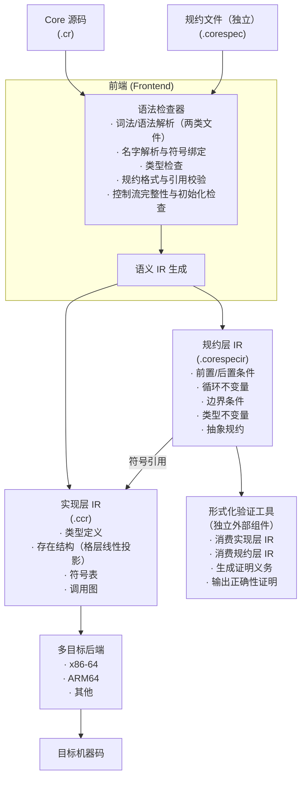

# Core 项目书

项目名称：Core — 一门以语义中间表示为中轴、天然支持完全形式化验证的自主语言编译系统

---

## 一、项目概述

Core 是一门全新的、完全自主设计的编程语言，以及一套围绕"语义保鲜"理念构建的编译工具链。

该工具链的核心是一个保留全部类型与语义信息的中间表示（IR），它不将高级结构降格为低级指令，而是将源码中所有隐式行为、语法糖、类型推导、符号解析全部摊平、归一化、显式化，形成一份"语义源代码"。

在此基础上，Core 原生支持完全形式化验证。验证机制由两部分组成：

- 实现层 IR：由 Core 源码编译生成，承载程序"做什么"的完整语义。
- 规约层 IR：由独立的规约文件编译生成，描述程序"应该做什么"——包括前置条件、后置条件、循环不变量、边界条件、类型不变量、抽象规约。规约文件引用实现代码中的符号，但不包含可执行逻辑。规约层 IR 独立存储，与实现层 IR 并列，通过符号引用精确关联。

任何外部形式化验证工具都可以同时消费实现层 IR 和规约层 IR，直接获取程序的完整语义模型和证明义务，无需自行重建语义。

系统内置语法检查器，位于前端内部，在输出 IR 之前对源码的全部语法与语义进行校验。语法不合法、类型不匹配、名字未解析、规约格式有误的代码将被拒绝进入下游。基于语义 IR，系统同步提供多目标代码生成后端及模块化缓存与分发机制。

Core 的目标是证明：一门现代语言可以同时获得快速编译、轻松跨平台、完全形式化验证三种能力，并且在语言设计上不互相妥协。

> 完整愿景叙事（"为什么存在"）见 `docs/z-vision.md`。

---

## 二、背景与问题

当前编程语言与编译生态面临四重割裂：

1. 编译时间膨胀

大型项目重编译耗时巨大。问题不在于代码生成慢，而在于每次编译都要重复完成对高级语言特性的解析与消解——头文件展开、泛型实例化、重载决议——这些工作在不同编译单元、不同目标平台、甚至同一项目的多次构建中一遍又一遍重复执行。每一次编译都在重新发现已经发现过的语义。

2. 跨平台代价与虚拟机臃肿

"一次编写到处运行"依赖运行时虚拟机，引入持续的内存开销和启动延迟。静态交叉编译虽然消除了运行时依赖，却仍需在每个目标平台完整运行前端，从源码开始全套解析。语义信息在逐级翻译中流失，平台间行为差异难以根除。

3. 形式化验证与程序实现严重脱节

程序实现和形式规约用不同语言书写、由不同工具处理、存储在不同文件中。验证器必须同时解析两者，自行建立程序语义模型后再对照规约进行证明。更换验证工具需要重新构建语义模型；修改代码后规约需手动同步；不同验证工具之间的证明结果无法互认。

4. 执行模型的人为割裂

传统语言为不同场景设计不同执行模式——调试模式、发布模式、硬实时模式、教学模式。程序员必须在代码或构建配置中显式选择。模式切换可能引入行为差异甚至隐蔽的错误。学习用一套环境，开发用另一套，教学用第三套——使用者始终在不同心智模型之间跳跃。

这四个问题的共同根源在于缺少一个同时承载程序实现语义与形式规约的中间层，以及一个不需要模式概念的通用执行模型。

---

## 三、核心思想

Core 的设计围绕三个核心原则展开。

### 3.1 语义 IR：单一事实源

Core IR 与传统编译器 IR 的区别在于保留语义信息而非逐步丢弃。传统流水线中，类型、泛型参数、名字等高级信息在翻译过程中逐级丢失。Core IR 在语法检查后将所有语义信息显式编码为统一格式，供下游按需消费。

具体而言，实现层 IR 保留以下信息：

- 结构化类型与接口作为一等结构（struct/enum/impl/interface），完整保留成员签名、实现关系与方法解析，不降级为无类型的数据块
- 泛型参数保留，不擦除类型实参
- 名字解析为包含模块路径的限定名
- 语法糖归一化为标准语义节点
- 控制流以图的形式存储

### 3.2 规约层 IR：行为约束的独立存储

形式规约不是注释，不是附加到实现代码上的标记，而是独立的源文件。

一个 Core 项目由两类文件组成：

- 实现文件（.cr）：包含可执行代码——函数、类型、控制流。
- 规约文件（.corespec）：包含行为约束——前置条件、后置条件、循环不变量、边界条件、类型不变量、抽象规约。规约文件中引用实现代码中定义的符号（函数名、类型名、变量名），通过完全限定名精确关联。规约表达式限于纯逻辑运算：无副作用，不可调用非常函数。

两类文件分别通过语法检查器处理后，生成两份独立的 IR：

- 实现层 IR（.ccr）：程序做什么。
- 规约层 IR（.corespecir）：程序应该做什么。

两者之间的关系是：规约层 IR 中的每一条约束，都通过符号引用精确指向实现层 IR 中的对应实体。这种关系不是物理上的"合并"，而是逻辑上的"约束"。

这样做的好处是实质性的：

- 规约与实现独立演化：修改规约不影响实现层 IR 的编译结果，不同粒度的规约可以搭配同一份实现层 IR 使用。
- 验证工具零门槛消费：验证器不需要解析 Core 源码，不需要重建语义模型——实现层 IR 已经给出了精确的程序语义，规约层 IR 已经给出了结构化的证明义务。
- 与特定工具解耦：规约层 IR 是公开格式。不同验证工具、不同求解器后端、不同证明策略，消费的是同一份数据。更换工具不需要重写规约。
- 多级验证粒度：核心模块可配备完整的规约文件，非关键模块可以只配备部分规约或不配备。验证工具可以按需选择要证明的性质集合。

### 3.3 单一执行模型

Core 只有一种执行语义：HDFG（Holographic Dataflow Graph，全息数据流图——从数据流图演化的语义承载图：任何消费者——执行后端、验证器、AI——都能从图中读取全部语义，无信息丢失）。

所有代码经语义 IR 翻译后构成一张有向图——节点是操作，边是数据依赖。图承载程序的全部执行语义——代码写了什么（函数调用、loop、go），图就反映什么：

- 纯函数、分支、for 循环 → 有向无环图（DAG）——依赖偏序，无反馈。
- loop、recv → 带反馈环的图——迭代语义，region 边界表达迭代与终止。
- flow、go、yield、select → 运行时动态图——节点创建与并发语义。

图是执行语义的载体，**不是执行方式的决定者**：执行方式（串行、并行、调度策略）由部署配置决定——同一张 DAG，单核串行、多核并行、无 OS 抢占式时间片。图只约束语义（依赖、迭代、并发结构），不决定物理执行。同样，图也是存储语义的载体——值即条目（配方可重算），存储即缓存（范式无关），内存只是经典映射（见 `docs/memory-model.md`）。

**三层映射（2026-08-27 正式晋升）**：语义 → 图 → 格 → 编码——**图负责表达计算**（关系空间），**格负责承载计算**（内存模型 = 中间存在空间），**编码负责实现计算**（物理编码空间；2026-08-27 更名：原「二进制」硬编码经典惯例）。跨范式发生在图层，超图灵性属于图不属于格；格的价值 = 表达空间未被有限范式封顶——不同范式各找自己的格映射（见 `docs/memory-model-capability-lattice.md` §四；v4 定稿：规则封闭对象开放 / 无格承诺 / 能力不提升一等公民 / 寄存器分配 = 缓存语义映射实例，`docs/regalloc-cache-mapping.md`）。

物理约束（内存分配策略、核心数量、操作系统支持）由部署配置文件声明，编译器据此生成适配目标环境的代码。同一份源码的语义行为在不同部署配置下保持一致。

---

## 四、系统架构


```mermaid
graph TD
    A["Core 源码<br/>(.cr)"]
    B["规约文件（独立）<br/>(.corespec)"]

    subgraph Frontend["前端 (Frontend)"]
        checker["语法检查器<br/>· 词法/语法解析（两类文件）<br/>· 名字解析与符号绑定<br/>· 类型检查<br/>· 规约格式与引用校验<br/>· 控制流完整性与初始化检查"]
        irGen["语义 IR 生成"]
        checker --> irGen
    end

    A --> checker
    B --> checker

    implIR["实现层 IR<br/>(.ccr)<br/>· 类型定义<br/>· 存在结构（格层线性投影）<br/>· 符号表<br/>· 调用图"]
    specIR["规约层 IR<br/>(.corespecir)<br/>· 前置/后置条件<br/>· 循环不变量<br/>· 边界条件<br/>· 类型不变量<br/>· 抽象规约"]

    irGen --> implIR
    irGen --> specIR

    specIR -->|符号引用| implIR

    backend["多目标后端<br/>· x86-64<br/>· ARM64<br/>· 其他"]
    verifier["形式化验证工具<br/>（独立外部组件）<br/>· 消费实现层 IR<br/>· 消费规约层 IR<br/>· 生成证明义务<br/>· 输出正确性证明"]

    implIR --> backend
    specIR --> verifier

    target["目标机器码"]

    backend --> target
```

### 4.1 前端与内置语法检查器

前端是系统中唯一进行复杂分析的组件。它必须处理两类源文件——实现文件和规约文件——并在生成任何 IR 之前完成全面的语义校验。

语法检查器承担以下职责：

- 词法与语法解析：并行解析实现代码与规约文件，覆盖语言全部语法结构。任何不符合语法规则的输入在此被拦截，给出精确的错误位置和描述。
- 名字解析与符号绑定：将所有名字（类型、函数、变量、模块）完全解析为包含完整模块路径的限定名，建立全局符号表。未定义引用、重复定义、循环依赖等错误在此被截获。
- 类型检查：对所有表达式、赋值、参数传递、返回语句执行严格类型兼容性验证。不允许隐式窄化转换，类型不匹配的代码不通过。
- 规约格式与引用校验（关键职责）：检查规约文件的语法结构是否合规，规约引用的符号在实现代码中是否真实存在，引用的函数是否为纯逻辑函数，表达式是否仅使用无副作用的运算。规约中引用了不存在的变量、或前置条件放在了非法位置——这些都在编译时被拦截，而非等到验证阶段才发现。
- 控制流完整性检查：确保每个代码路径都有正确的返回值，变量在使用前已初始化，模式匹配穷尽所有分支。

语法检查通过后，两份源文件分别翻译为实现层 IR 和规约层 IR，两者通过符号引用精确关联，分别存储，各自独立。

### 4.2 实现层 IR

实现层 IR 是程序执行语义的完备编码。它包含：

- 类型定义节点：结构体、枚举、接口、代数数据类型。每个节点完整记录实现关系、成员签名、可见性。具体内存布局由后端决定，但做出布局决策所需的所有语义信息均被保留。
- 函数与方法的执行结构：region 嵌套（SG 段 = 图锚定存在结构）+ 格形态 .ccr（v6：段表 + ENT 存在结构段，v6-only——存在区间/共存/驱逐承载，见 `specs/2026-09-05-lattice-ir-v6-format.md` + `2026-08-27-lattice-form-ir-design.md`）。指令为高级语义原语——静态调用、对象分配、字段读写、数组读写、分支、循环。每一条指令的源操作数和目标操作数均为完全解析的符号引用。
- 图拓扑元数据：标注每个子图的结构特征（DAG、静态循环、动态生长），为后端选择执行策略提供依据。
- 全局符号表：模块间引用全部解析为直接索引。无重复、无歧义。

### 4.3 规约层 IR

规约层 IR 独立于实现层 IR 存储，它专门承载行为约束。其内容包括：

- 前置条件：函数或方法调用前，调用方必须保证成立的条件。可引用参数、全局状态。
- 后置条件：函数或方法返回后，实现方必须保证成立的条件。可引用返回值、参数、旧状态。
- 类型不变量：该类型的任何合法实例在任意可观测时刻都必须满足的性质。
- 循环不变量：在循环每次迭代之前和之后都保持为真的性质。
- 边界条件：证明循环终止所需的递减度量（变体）。
- 抽象规约：接口或抽象类对其所有实现方施加的契约。

规约公式可引用：程序的可见实体（通过限定名）、特殊逻辑符号（如 result 表示返回值、old(x) 表示调用前的值）、纯逻辑函数和谓词。

规约层 IR 不被任何代码生成后端触及。它被形式化验证工具消费（验证工作流见 docs/spec-design.md——规约经翻译桥进入 CIC 内核 + SMT 证书验证）；已证性质可回流入优化器（证明驱动优化，见 spec-design §13）。

### 4.4 代码生成后端

后端是完全机械的翻译器。它只接收实现层 IR，不接触规约层 IR，不执行任何语义分析或跨过程优化。

每个后端维护一张指令映射表，将实现层 IR 中的每一条高级指令映射为目标平台的指令序列。后端根据 IR 中的图拓扑元数据自动选择执行调度策略——DAG 用串行、静态循环用固定节奏、动态图用协作式或多核并行。程序员不指定策略，编译器也不要求程序员指定。

后端的平台特有职责仅限于指令选择、寄存器分配、调用约定。每个后端是机械翻译器（现有 x86-64 ELF 后端见 src/arch/linux/ld/，直接发射 ELF，不依赖外部 as/ld）。

### 4.5 部署配置

物理世界的约束——内存模型、核心数量、操作系统支持——不属于程序语义，属于部署目标的属性。

这些属性在部署配置文件中声明（如 .toml 格式），而不是在代码中。编译时，编译器读取部署配置，与实现层 IR 进行兼容性检查：

- 目标不支持动态分配 → 编译器检查所有数据结构大小是否编译期可确定。不可确定则拒绝编译，给出明确错误及位置。
- 目标支持动态分配 → 生成使用目标分配器的代码。
- 声明资源配额 → 生成配额检查指令。未声明即无限制。

同一份实现层 IR，搭配不同的部署配置，即可适配不同的目标平台。代码不变。

I/O 等平台接口与部署目标属性同属物理层，遵循同一原则线：程序语义是流变换——程序 = 流转导器 (输入流) → (输出流)，输入输出是同一数学对象（流）的两端，输出即对世界的输入。read_file/write_file/print/println 等 API 是语义接口（现有 API 保持不变），read/write 等系统调用是物理实现，由后端按部署目标隔离；验证意义上，I/O 程序语义 = 流变换，规约可描述「输入流性质 → 输出流性质」，I/O 是一等公民语义而非验证黑洞。随机（概率分布）、哈希（散列函数）、时钟（单调时间序）同理：语义接口在语言层，熵源、算法、系统调用在后端实现。

### 4.6 指针安全

Core 的指针安全完全建立在HDFG上，不引入 borrow checker、Arena tag、RawRef 等独立概念层。编译器从图中推导每个指针的来源（provenance）和偏移，在解引用点自动验证。详见 `docs/pointer-model.md`。

存储语义本体为**缓存语义**（值 = 配方、条目可驱逐可再生、图边界为唯一不可再生来源）；字节内存是其在经典硬件上的映射实例——见 `docs/memory-model.md`。

### 4.7 形式化验证工具（外部系统）

形式化验证工具是语义 IR 的独立消费者，不属于 Core 系统内置组件。

典型工作流程：验证工具加载实现层 IR 和规约层 IR → 从实现层 IR 构建程序数学模型 → 从规约层 IR 提取证明义务 → 将证明义务翻译为 SMT 公式或定理证明器脚本 → 提交求解 → 输出结果。

不同验证工具可使用不同策略、不同求解器后端，但它们消费的是同一份 IR 数据。更换工具无需重写规约文件。规约格式不与任何特定工具绑定。

---

## 五、执行模型：HDFG 驱动的执行

Core 的执行模型可以完整描述为一句话：程序即 HDFG——图承载全部执行语义，执行方式由部署配置决定，图语义不变。

### 5.1 DAG：确定性的顺序执行

最简单的程序——变量绑定、算术运算、函数调用、条件分支、for 循环——编译后产生有向无环图。图中每个节点在其全部输入就绪后恰好执行一次，产生输出令牌。

执行器按拓扑序遍历节点。在任何时刻，只有一个节点在执行，程序的全部状态完全可观测、完全可预测。单步调试就是逐步走图。

这保证了初学者的第一个程序和执行模型的第一次接触，没有任何心智负担。

### 5.2 带环静态图：有节奏的循环

当代码中出现 loop 构造，图中引入带环结构：编译为嵌套 region（loop/for 结构节点
含子区域，region 嵌套的层次无环图）。执行器按迭代周期调度：每个周期内循环体子 region
按拓扑序执行；周期结束回到 region 头部触发下一轮迭代。循环不变量和变体标注于
region 边界，供验证工具证明终止性和循环正确性（终止性依赖经 state edge 显式表达）。

### 5.3 动态图：并发与自适应

当代码中使用 flow、go、yield、select，图的拓扑可在运行时变化。新节点通过 go 动态创建，节点间的流通过 yield/recv 传递令牌，select 在多个输入边之间等待最先到达的令牌。

多核目标上，各节点被分配到独立线程并行执行。单核目标上，使用协作式调度。同一份语义 IR，编译器根据部署配置中的目标信息自动选择调度方案。

### 5.4 同一份代码的多种部署

以下代码：

```core
fn add(x: int, y: int) -> int {
    return x + y;
}

fn main() {
    result := add(3, 4);
    println(result);
}
```

- 部署为单核嵌入式 → 编译器生成串行机器码，静态分配，零运行时。
- 部署为多核服务器 → 编译器可并行化不相关的计算路径。
- 部署到教学环境 → 解释器按拓扑序逐步执行，每步展示变量值。
- 部署为分布式系统 → add 节点可远程执行，输入输出为网络消息。

代码不改。图语义唯一。部署配置不同。

---

## 八、总结

Core 要回答的问题是：如果在语言设计之初就将语法检查、语义 IR 和规约 IR 纳入统一框架——实现层 IR 承载程序语义，规约层 IR 承载行为约束，两者分立但通过符号精确关联——那么编译速度、跨平台能力和形式化验证的门槛可以降低到什么程度？

Core 项目将用实际可运行的代码来回答这个问题。
